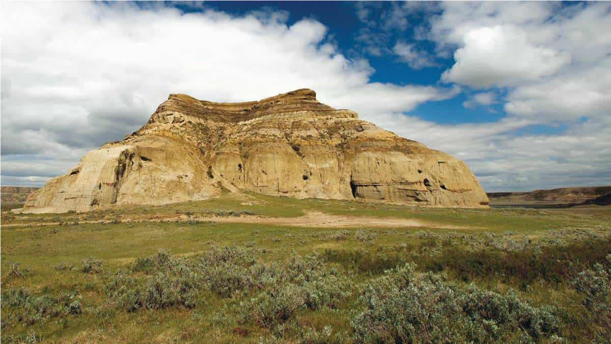
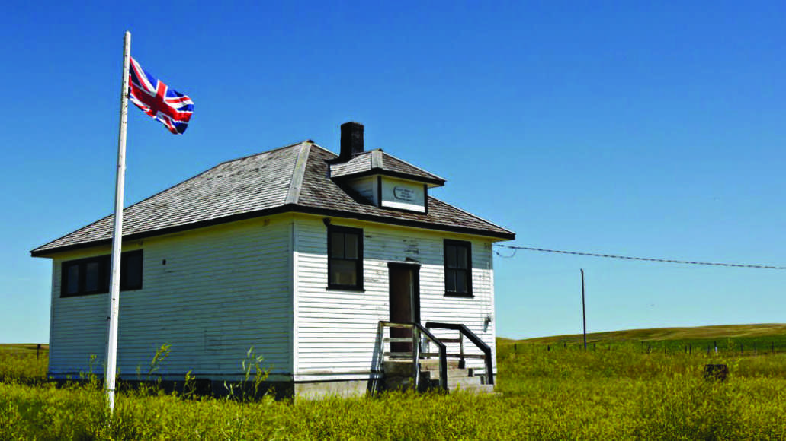
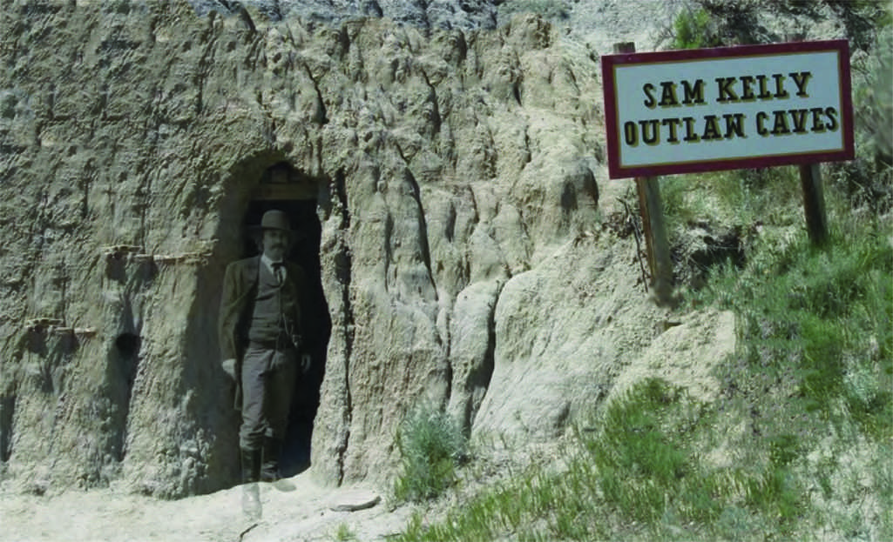

*Think Saskatchewan is flat? Think again! A visit to the Big Muddy Valley will leave you in awe of the rugged beauty surrounding the historic buttes and caves of the badlands. Listen carefully and you might hear echoes of the past...*

    </img>

This summer is the perfect time to visit us and explore the hills, valleys and history offered in the Big Muddy Valley. Come see Saskatchewan's Castle Butte, an age old landmark used from the very earliest settlers and travelers as a directional point. Climb to the top for one of the most fantastic views. Relive the history of cattle rustlers and horse thieves hiding in the caves to dodge the law on both sides of the border. Walk where infamous outlaws like Butch Cassidy, Dutch Henry and Sam Kelly and their men hid their stolen livestock. 

<figure class='col-sm-4 col-5 float-right ml-3'>
    
    <figcaption>Paisley Brook School</figcaption>
</figure>

See the early development of the North West Mounted Police in this area, the location of the first depot in this part of the country. The Buffalo and Turtle effigies, ceremonial circle and tipi rings that were so very sacred to the First Nations tribes that lived in the area. The Big Beaver Nature Center displays the animals and history of the area in a very unique way, and a stop at Aust's General Store will remind you again of what a general store used to be. We will take you to visit Paisley Brook School, a century-old building. You will see how different it was going to school in the early days.

#Sam Kelly Outlaw Caves

    </img>

In 1903, outlaw Sam Kelly joined forces with notorious horse thief, Dutch Henry, and outlaws Bloody Knife and Pigeon Toe Kid. Known as the Wild Bunch, they would steal as many as 200 horses on one drive, alter their brands, herd them into Canada, sell them, and then steal them again for resale back in Montana and the Dakotas.

The Big Muddy was an ideal haven for outlaws. Sam Kelly enlarged a weathered wolf den for his living quarters and used a nearby cave to hide his horses.

Take a tour of the Sam Kelly Outlaw caves - they are still very much the same as how he left them..

Spend the night and take in all that our friendly little town has to offer. The Poolside Park is a campground located right in town next to a heated swimming pool, kids spray park, 2 playgrounds, basketball court and a soccer field. One block away is our scenic 9 hole, 3000 yard, grass green golf course which overlooks the Poplar River, rolling hills and grain fields. We also have the Poplar River Community Park campground, 5 kms east of Coronach, located at the Cookson Reservoir. The park offers boat docks, great fishing and powered sites. Plan your trip to coincide with Dam Days held on the last weekend in June 2020 at the Poplar River Community Park campground or with our 1st Annual Street Festival on August 29, 2020.

Coronach has a motel and hotel in town and a B & B located a few miles outside of town. Some dining options include Deb's Country Kitchen, RC Chinese Restaurant, Coronach Hotel and the Rustic Tavern. Pick up snacks or a lunch at The Nook and stop in at the Mini Mart for some of the best summer treats in the area. Take time to stop at the Coronach District Museum, the site of Coronach's original hospital. You will find local artifacts and history dating back to the 1900's.

For more information visit our website at [www.townofcoronach.ca](https://www.townofcoronach.ca) or call 306-267-3312.
