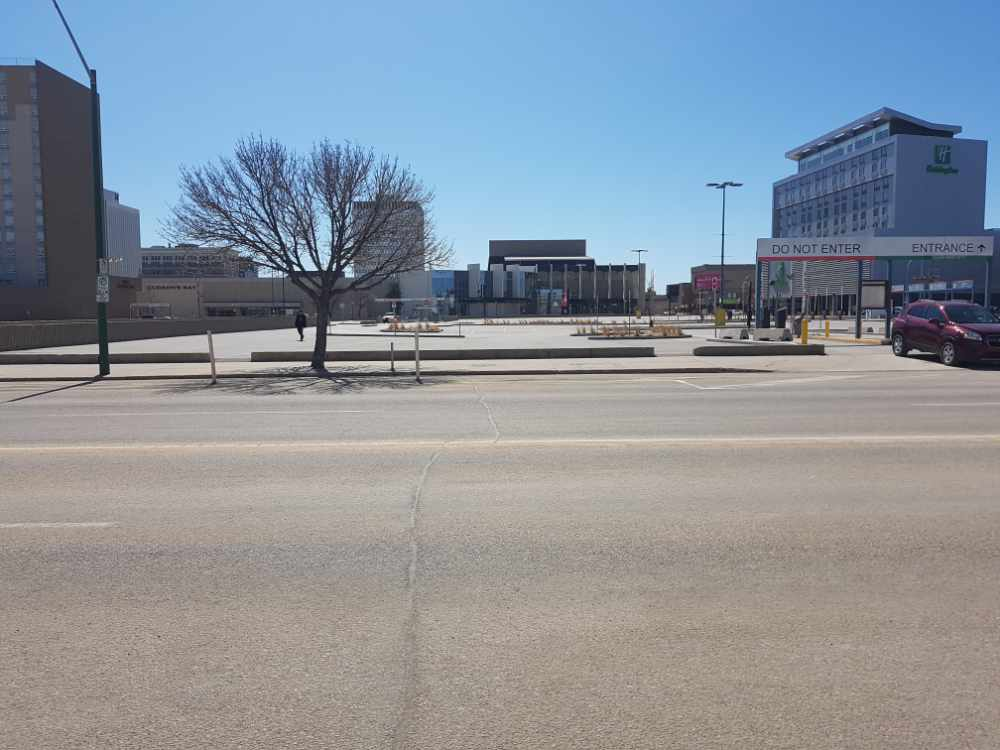
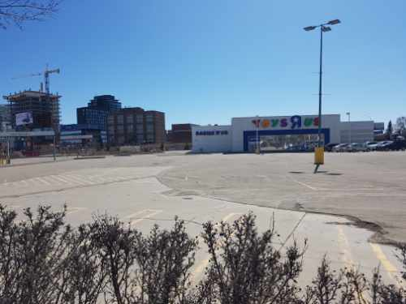

    </img>

In late 2018, City Council decided that if Saskatoon was to get a new arena, it should be downtown, as part of a larger entertainment district that would include a convention centre. Nearly a year and a half later, no definitive location has been announced and many logistical considerations loom, raising questions about where such a building should go.

Here, three locals weigh in on where downtown the arena and entertainment district should be. For Bertrand Bartake of Kindrachuk Agrey Architecture, the question of where depends on whether the arena would be built together or seperate from a convention centre.

"If we're looking at just an arena, my preference is the Toys "R" Us site, because that site is the most accessible for walking," Bartake said. "That site has connections to Nutana, Riversdale and communities south of Riversdale, plus it gives you the opportunity to walk to bars and restaurants in Broadway, Riversdale and downtown."

Bartake said the Toys "R" Us site is not large enough for both an arena and convention centre. When discussing a site that would accommodate both, he says the Midtown parking lot would be an option, and provides access to transit and hotels nearby.

Todd Brandt, the president and CEO of Tourism Saskatoon agrees with the Midtown as a starting point.

"For us, the nucleus is the Midtown, and then you can build fairly contiguous to that, which allows linkage to existing facilities like the theatre in TCU," Brandt said. "If you look at the area north of Midtown, or immediately south, there's the benefit of linking to other facilities like Persephone Theatre and the Remai Modern, which are things that add interest to conference planners."

    <figure class='col-sm-5 col-10'>
        
        <figcaption>North of Midtown, Saskatoon</figcaption>
    </figure>
    <figure class='col-sm-5 col-10'>
        
        <figcaption>South of Midtown, Saskatoon</figcaption>
    </figure>

He says that an arena and convention centre don't necessarily need to be attached, but that certain criteria needs to be considered.

"A convention centre needs to be a minimum distance from accommodation facilities and walkability is important. We don't need more accomodations in Saskatoon; we have 5500 hotel rooms now, so we need to utilize that," Brandt said.

Darla Lindbjerg, president and CEO of Saskatoon Chamber of Commerce, says that looking north of Midtown is a good option. She says that Saskatoon's transportation system also needs to grow with such a building. "It is crucial that the city connect an entertainment district to an accessible transportation system - the Bus Rapid Transit for now, but with the capacity as the city grows to adapt into an LRT line," Lindbjerg said. "Although public transportation is key for environmental and parking issues, it is still important that there be extensive parking available."

Bartake notes the downtown is ideal for its proximity to parking.

"The downtown has access to 20,000 parking stalls, and use of those parking stalls is usually during the day when people are working downtown. In evenings there's free parking and a lot of private paid parking that's available," he said. Either way, Brandt notes that considering the city's growth, and planning for future needs is key.

"I think we need to say, 40 years from now, what's a reasonable size for a convention centre? If it's 2070 and the typical convention sizes are this, what do we need to be competitive now, and years down the road? It's been 50 years since the [current] facility was built, and we need to step back and say, okay we need to blow up this area to facilitate economic growth for many years to come," he said. Lindbjerg agrees, noting the economic benefits of a downtown location.

"Building a new arena will offer our community a competitive leg up in bringing shows and events to Saskatoon that our current facility cannot support due to its age, layout and load-bearing ability," she said. "It is much better for our community to have a key piece of entertainment infrastructure in the heart of our city, generating positive economic spinoff for our businesses and the people they employ."
