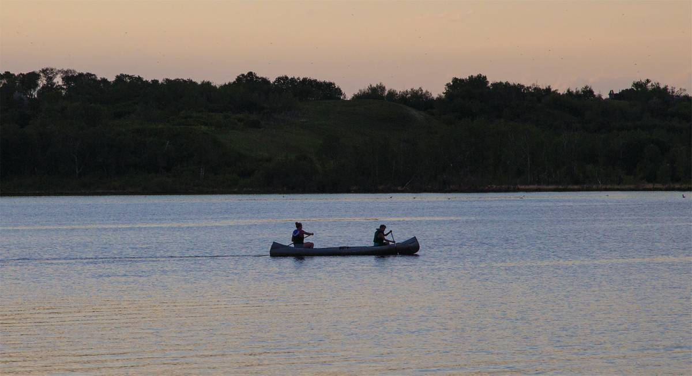
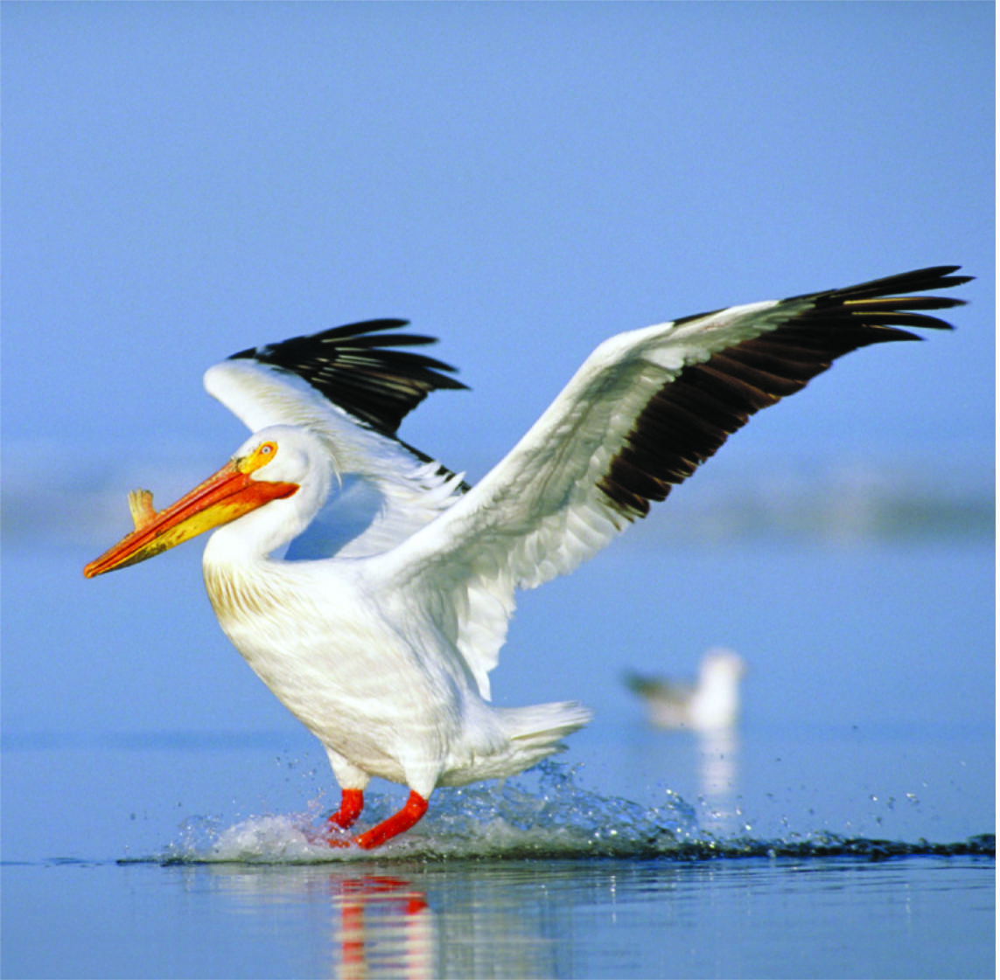

*After a long prairie winter, Saskatchewan residents often can't wait to get out and enjoy one of our Hundred Thousand Lakes. And enjoy we do!*

    </img>

In the 2012 Canadian Nature Survey, in the prior 12-month period, nearly half of Saskatchewan people reported non-motorized water vehicle and beach use, and one third reported fishing.

In recent summers, harmful algae blooms (HABs) have increasingly threatened Saskatchewan residents' enjoyment of freshwater resources for recreation. One of the main culprits: blue-green algae or cyanobacteria.

Blue-green algae can sometimes take on the appearance of foamy pea soup, and at its worst can smell like rotten eggs. Most troubling, it can produce a toxin called microcystin that can pose a threat to drinking water supplies, and can be harmful to humans, pets, and wildlife.

In the summer of 2019, the Government of Saskatchewan launched its new Healthy Beach Program, designed to keep the public aware of water quality issues at 67 public swimming areas- and serving as a harbinger of declining water quality across the province.

Development of HABS in waters used for recreation is dependent on many factors that can be difficult to predict. Blooms are more likely to occur during hot, sunny weather, in calm water that is rich in nutrients like phosphorus and nitrogen.

> In the summer of 2019, the Government of Saskatchewan launched its new Healthy Beach Program.

Here on the Prairies, much of the soil has naturally high levels of phosphorus; lakes tend to be shallow and warmer and naturally nutrient-rich or eutrophic. Add to the mix hotter summers, sporadic rainfall events, and excess nutrients introduced via runoff, and the incidence of HABs is increasing, particularly in southern lakes. Reducing inputs of nitrogen and phosphorus to aquatic systems is believed to be the most effective option for managing toxic bluegreen algae blooms.

    </img>

## Wetlands to the rescue

Across the country, Ducks Unlimited Canada is involved in research on the role wetlands play in improving water quality. While there is more work to be done, the science so far is telling the story of wetland processes that work in concert to absorb and breakdown nutrients, resulting in water that is cleaner leaving than entering a wetland basin.

    </img>

In some study areas, such as the eutrophic lakes of the Pembina Valley in Manitoba, wetland restoration has been shown to help improve water quality and reduce algae blooms downstream. The message is clear: Saskatchewan needs its wetlands now more than ever. For more information on wetlands, water quality, and how you can help Save Our Summers, please visit [www.facebook.com/DUCSaskatchewan/](https://www.facebook.com/DUCSaskatchewan/).
